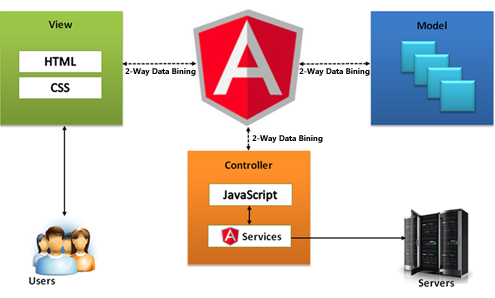
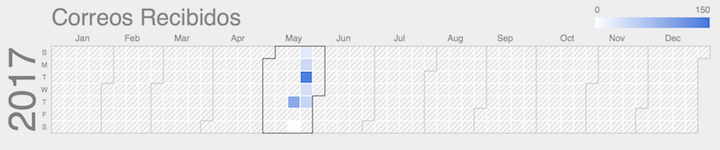
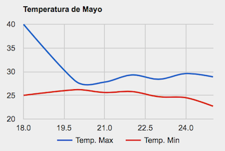
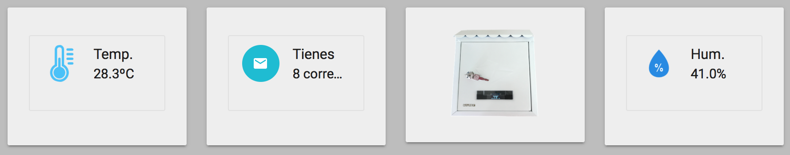
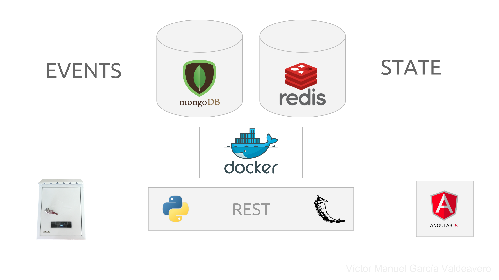

# smart-mailbox

How to start the project

```
git clone <this-repo>
cd <this-repo>
docker-compose up -d
````

If there are changes
```
docker-compose build
docker-compose stop && docker-compose up -d
```

## Interactive SmartMailbox system.
 
Smart Mailbox with high functionality.
 
* Look the number of letters inside your Smart Mailbox.
* Get a history of correspondence received in your dashboard.
* It displays real time status of your Smart Mailbox, controlling the state of the inlet opening and the door.
* Get information about the temperature and humidity of the location of your Smart Mailbox.
* Displays the current month history of maximum minimum temperatures and humidity of the environment your smart mailbox.
 
All from a customizable web easily accessible.
 


## Schema


## Wiring

| Component               | Pin |
|-------------------------|-----|
| Photoresistor           | A0  |  
| Door Hall effect sensor | D1  |  
| Pin Hall effect sensor  | D2  |  
| OLED SDA                | D3  |
| OLED SCL                | D4  |
| DHT22                   | D5  |  
| LED                     | D6  |  

All components operate at 3.3V.

## Project structure

* `iot/platformio.ini`: PlatformIO project configuration and dependencies.
* `iot/src`: Source folder.
    * `iot/src/main.cpp`: Main program.
    * `iot/src/fonts.h`: OLED fonts and icons definitions.
    * `iot/src/config.h.example`: Example wireless and server configuration. Rename to `config.h' on deployment.
* `dashboard/`: Web app to manage the project

### Required libraries

* [ESP8266_SSD1306](https://github.com/squix78/esp8266-oled-ssd1306)
* [DHT22](https://github.com/adafruit/DHT-sensor-library)
* [NTPClient](https://github.com/arduino-libraries/NTPClient)
* [ESPasyncTCP](https://github.com/me-no-dev/ESPAsyncTCP)

If you use PlatformIO, these libraries are already configured on the project.

## Dashboard

For the dashboard we use **Angular.js** as a framework to develop it, as a requirements we don't need anything but a web server like apache or nginx. To change the address of the API within the dashboard you have to change a line in the services/MainService.js file.

```
app.service('MainService', ['$http', function ($http) {

var urlBase = 'http://apiaddress:8080';

...
```

We use a MVC schema to develop the app.



### Dashboard - Google Charts

To draw charts we call the google charts library, with it we draw 2 different kinds of charts.


* Calendar charts:



* Line charts:



### Dashboard - RealTime statistics

In our dashboard we can control the status of our mailbox (doors and letters) in real time, besides that we can see the temperature and humidity on the fly.

 

## API 

All communications is done via HTTP REST services. We have an REST service made in Python and Flask. Persistence is achived using MongoDB for storing events and Redis for hadling the state of the doors.

All infraestructure is based in Docker both in development and in production. Our production machine is a Ubuntu Server 16.04 hosted in Azure.

 