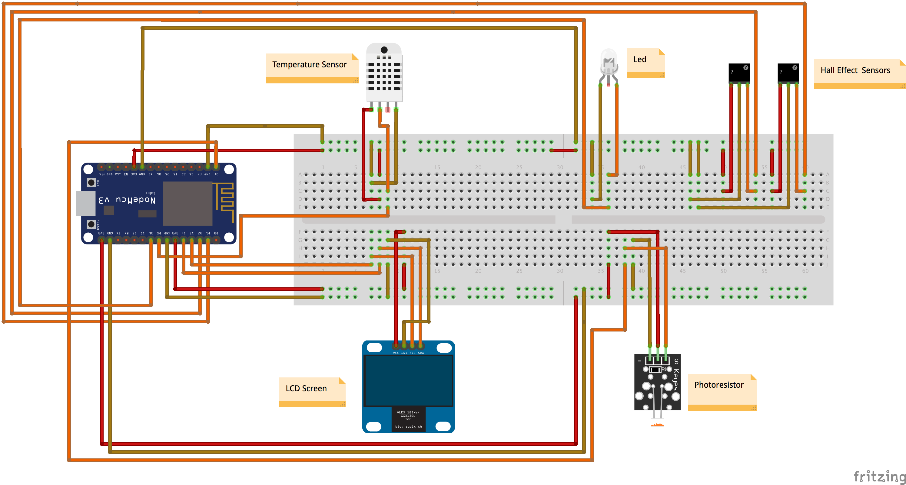

# smart-mailbox

How to start the project

```
git clone <this-repo>
cd <this-repo>
docker-compose up -d
````

If there are changes
```
docker-compose build
docker-compose stop && docker-compose up -d
```
Schema


